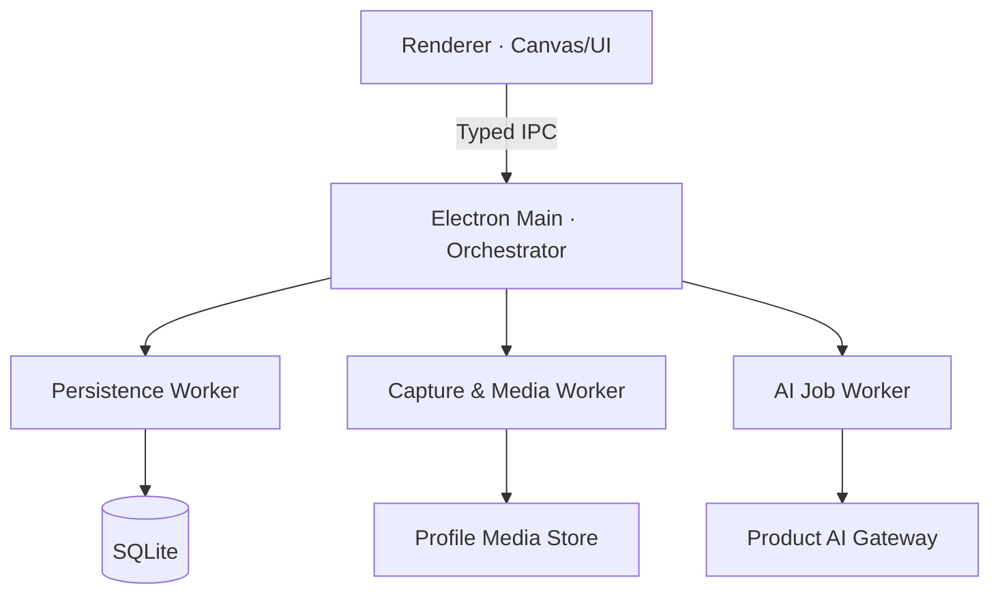
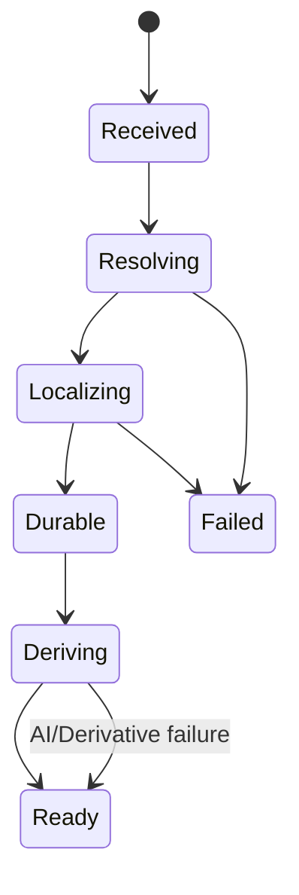

# Architecture.md v2.1 — Capture-first Temporal Spatial Inspiration Board

> **Document Status**：Architecture Decision Baseline v2.1  
> **Product Source of Truth**：`PRD.md v2.1 — Capture-first Temporal Spatial Inspiration Board.md`  
> **Interface Structure Inputs**：`InformationArchitecture.md v0.4` + `ReferenceMapping.md v0.2`  
> **Target Platform (P0)**：Windows 11 + Chrome / Edge  
> **Deferred Platform**：macOS  
> **Architecture Rule**：本文件解释如何实现 PRD，不得反向修改 PRD 的 Requirement ID、优先级与产品骨架。

---

# 0. Architecture Governance

## 0.1 文档职责

本文件负责确定：

- P0 桌面框架与进程边界；
- Windows 11 窗口、Always-on-top 与 Workspace Restore 的实现责任；
- Pinterest / Browser → Desktop Canvas 的 Drag Capture 管线；
- 本地数据库、媒体文件、派生文件与 Cache 的边界；
- Day Canvas 世界坐标、Viewport 与 z-order 数据模型；
- 自动保存、关闭保护、崩溃恢复和写入一致性协议；
- AI 请求的数据边界、异步状态和失败隔离；
- 安全、性能、迁移、可观测性与技术验收门槛；
- P0、P1、Pro 与未来平台之间的架构扩展点。

本文件不负责：

- 改写产品功能与优先级；
- 决定 UI 视觉细节；
- 编写 AI System Prompt；
- 将 Journal 提前并入 P0；
- 将 Week / Month 重新定义为原始数据本体；
- 为尚未进入 PRD 的同步、协作、账号系统设计实现。

## 0.2 Requirement Traceability

| 架构领域 | 主要 PRD 约束 |
| --- | --- |
| Desktop Shell | `PD-001`、`WIN-001`、`WIN-004 ~ WIN-009` |
| Capture Pipeline | `CAP-001 ~ CAP-007`、`IMG-001`、`IMG-005 ~ IMG-007` |
| Canvas Model | `DAY-001 ~ DAY-007`、`CAN-001 ~ CAN-004`、`OBJ-*`、`LAY-*`、`LCK-*` |
| Local Persistence | `PC-003`、`SAVE-001 ~ SAVE-006` |
| AI Boundary | `AI-001 ~ AI-006`、`TAG-*` |
| Temporal Model | `PC-004`、`TIME-*`、`WEEK-*`、`MONTH-*` |
| Journal Boundary | `PC-005`、`JRN-*` |

发生以下任一情况时，必须先更新 PRD，再更新 Architecture：

- P0 首发平台不再限定 Windows 11；
- Browser Drag 不再是 P0；
- Day 不再是原始数据本体；
- 系统被允许自动重排用户空间关系；
- AI 被允许在无用户指令时改变分类、位置、尺度或层级；
- Capture 与 Journal 的单向引用关系被改变。

---

# 1. Architecture Drivers

架构决策依次服从以下驱动因素，排序不可颠倒：

1. **Capture Reliability**：Pinterest / Chrome / Edge 拖入后，素材必须可靠本地化。
2. **Flow Preservation**：图片出现、Move、Resize、Note 不等待 AI 或远程服务。
3. **Spatial Fidelity**：位置、尺度、遮挡、锁定与 Note 关系是一级持久化数据。
4. **Data Safety**：应用关闭、Renderer 崩溃、下载中断不得静默丢失已确认操作。
5. **Local Ownership**：Day、对象、Note、媒体原件和工作状态保存在本机自包含 Profile 中。
6. **Replaceable AI**：AI Provider 不进入本地领域模型，不成为打开 Canvas 的依赖。
7. **Mac-ready Boundary**：领域层不得依赖 Windows API；Windows 能力封装在 Platform Adapter 中。
8. **Resource Efficiency**：安装体积和内存重要，但不得以牺牲 P0 Drag 稳定性为代价。

---

# 2. Architecture Decision Summary

| Decision ID | 定案 | 状态 |
| --- | --- | --- |
| `ADR-001` | P0 使用 Electron + Chromium Renderer | **ACCEPTED** |
| `ADR-002` | P0 只验收 Windows 11 + Chrome / Edge | **ACCEPTED** |
| `ADR-003` | Always-on-top 由 Electron Main Process 控制并持久化 | **ACCEPTED** |
| `ADR-004` | Browser Drag 使用 HTML5 DataTransfer 多候选解析管线 | **ACCEPTED** |
| `ADR-005` | 元数据使用 SQLite；媒体使用 Profile 内独立文件目录 | **ACCEPTED** |
| `ADR-006` | 原图不可变；工作图与 Thumbnail 可重建；Cache 可丢弃 | **ACCEPTED** |
| `ADR-007` | Day Canvas 使用 double 精度世界坐标；相机状态独立保存 | **ACCEPTED** |
| `ADR-008` | Renderer 乐观更新；Persistence Worker 单写入；Revision ACK 判定 Dirty | **ACCEPTED** |
| `ADR-009` | AI 使用 Product-managed Gateway；P0 不采用 BYOK 或本地模型 | **ACCEPTED** |
| `ADR-010` | AI 仅生成可替换语义派生数据，不得修改空间事实与个人 Note | **ACCEPTED** |
| `ADR-011` | P0 Canvas 使用可虚拟化 DOM Scene Renderer，不锁定到第三方白板文档模型 | **ACCEPTED** |
| `ADR-012` | Week / Month 由 Day 数据投影生成，不拥有可回写布局 | **ACCEPTED** |

---

# 3. Desktop Framework Evaluation

## 3.1 Evaluation Matrix

权重以当前 P0 而不是未来通用桌面产品为依据。

| 维度 | 权重 | Electron | Tauri 2 | WinUI 3 + WebView2 |
| --- | ---: | --- | --- | --- |
| Chrome / Edge Drag 语义接近度 | 30% | **高：同为 Chromium 事件模型** | 中：WebView2 + Tauri Drag 配置层 | 中高：WebView2 原生集成 |
| HTML5 DataTransfer 可调试性 | 20% | **高** | 中；Windows 下需处理 native drag 与 HTML5 drag 互斥 | 中；需编写更多原生桥接 |
| Always-on-top / Bounds Restore | 10% | **成熟直接** | 可用 | 可用 |
| JS Canvas / DOM 工程效率 | 15% | **高** | 高，但增加 Rust Command 边界 | 中 |
| SQLite / 文件 / 图片处理 | 10% | 高 | 高 | 高 |
| 安全隔离默认成本 | 5% | 中；必须主动收窄 IPC | **高** | 高 |
| 安装体积 / 内存 | 5% | 低 | **高** | 高 |
| macOS 后续迁移 | 5% | **低额外成本** | 低额外成本 | 低 |

## 3.2 Decision — Electron

P0 采用 Electron，原因是：

- Electron Renderer 与 Chrome / Edge 共享 Chromium 的 Web Platform 行为，最有利于复现和调试 Pinterest 外部 Drag 的 `DataTransfer` 数据；
- `BrowserWindow` 原生支持 Resize、Move、Always-on-top、窗口事件与 Close 拦截；
- Canvas、DOM Overlay、Clipboard 与 Drag 可以在同一 TypeScript 交互层实现；
- P0 的第一风险是 Capture 稳定性，不是安装包体积；
- macOS 后续仍可复用 Renderer、领域模型、SQLite Schema 和媒体管线。

## 3.3 Why Not Tauri for P0

Tauri 2 本身具备 Always-on-top、本地命令和较小包体积，但其 Windows WebView Drag 存在与本产品关键路径直接相关的额外条件：Tauri Webview 的 native drag-and-drop 默认启用，而 Windows 前端要使用 HTML5 Drag and Drop 时需要关闭该能力。

这意味着 P0 若选择 Tauri，需要先解决：

- WebView2 接收 Chrome / Edge 外部 Web Image Drag 的具体 payload 差异；
- native file-drop 与 HTML5 web-drop 的取舍；
- Rust / WebView 边界中的 payload 转换与调试；
- 未来本地文件 Drag 扩展时重新协调两套机制。

这些工作直接落在 `ARCH-Q006` 的最高风险点上，因此 P0 不采用 Tauri。Tauri 可在 P1 之后基于同一套 Drag Corpus 重新做技术对照，不视为永久否决。

## 3.4 Why Not WinUI 3 for P0

WinUI 3 能获得最深的 Windows 原生控制，但会增加：

- WebView2 与 Native Shell 的双栈复杂度；
- React / Canvas 事件与原生 Drag 数据的桥接代码；
- 后续 macOS 的 Shell 重写成本；
- 当前团队对核心 Capture 之外平台代码的维护负担。

Windows 原生扩展只作为 Electron 无法完成某项已验证 P0 能力时的局部模块，不作为整体框架。

---

# 4. Runtime Topology



## 4.1 Renderer Process

Renderer 只负责：

- Day Canvas 交互与视觉呈现；
- `DataTransfer` 的同步读取与候选描述提取；
- 世界坐标转换；
- Scene Store 的乐观更新；
- Dirty / Saving / Saved 状态展示；
- 通过 Preload 暴露的窄接口请求持久化、媒体导入和 AI 状态。

Renderer 不得：

- 直接访问 Node.js、文件系统或 SQLite；
- 持有 AI Provider Key；
- 任意请求本地文件路径；
- 执行拖入 HTML；
- 将远程页面装入主窗口；
- 绕过持久化 Revision 协议宣称“已保存”。

## 4.2 Preload Bridge

Preload 使用：

- `contextIsolation: true`；
- `nodeIntegration: false`；
- `sandbox: true`；
- `contextBridge` 暴露显式、版本化、可验证的 API。

允许的 API 按领域分组：

```ts
interface DesktopBridgeV1 {
  workspace: WorkspaceApi
  capture: CaptureApi
  persistence: PersistenceApi
  media: MediaReadApi
  ai: AiJobReadApi
}
```

IPC Payload 必须通过 Runtime Schema 校验。禁止向 Renderer 暴露通用 `invoke(channel, payload)`、任意文件路径读取或 Electron 原生对象。

## 4.3 Main Process

Main Process 负责：

- App Lifecycle 与单实例控制；
- BrowserWindow 创建、恢复、Always-on-top 与 Close Guard；
- IPC 鉴权与路由；
- 自定义只读媒体协议；
- Worker 生命周期、崩溃重启与 Flush 协调；
- 网络策略和 AI Gateway 连接。

Main Process 不执行高耗时图片解码、压缩或大批量同步 SQLite 操作。

## 4.4 Workers

### Persistence Worker

- SQLite 唯一写入者；
- 执行 Schema Migration；
- 合并 Mutation；
- 提交 Transaction；
- 返回 Durable Revision；
- 生成读模型与搜索索引。

### Capture & Media Worker

- 远程 HTTPS 图片获取；
- MIME Magic-byte 验证；
- Hash、尺寸、方向和颜色信息提取；
- 原图原子落盘；
- 工作图和 Thumbnail 生成；
- 失败后清理或恢复 Staging Job。

### AI Job Worker

- 读取已持久化、可发送的工作图；
- 管理 Queue、Retry、Backoff 与取消；
- 调用 Product AI Gateway；
- 校验结构化返回；
- 将关键词作为派生数据提交给 Persistence Worker。

P0 可以先用 Node `worker_threads` 实现 Worker；接口必须保持消息化，未来可迁移到 Electron `utilityProcess`，不得让 Renderer 感知实现变化。

---

# 5. Windows Workspace Architecture

## 5.1 BrowserWindow Policy

P0 主窗口使用单个 `BrowserWindow`：

- 标准可移动、可缩放窗口；
- 设置最小可用尺寸，但不固定为 Side Panel；
- Always-on-top 为用户可切换状态；
- 主窗口只加载打包后的本地 App 内容；
- 不创建 Pinterest 内嵌浏览器；
- 不使用 Chrome Extension / Manifest V3 作为主架构。

Always-on-top 由 Main 调用 `setAlwaysOnTop(flag, 'floating')`。Renderer 只发出用户意图，最终状态以 Main 的 `isAlwaysOnTop()` 与 `always-on-top-changed` 事件为准。

## 5.2 Workspace State

```ts
interface WorkspaceState {
  windowBounds: { x: number; y: number; width: number; height: number }
  isMaximized: boolean
  alwaysOnTop: boolean
  activeDayId: string
  backgroundSurfaceId: string
  updatedAt: string
}
```

窗口位置与尺寸使用 Windows Device-independent Pixel 语义保存。恢复时必须：

1. 枚举当前 Displays；
2. 检查上次 Bounds 与任一 `workArea` 是否有足够交集；
3. 若显示器已断开或 DPI 改变，将窗口夹入 Primary Display 的可见范围；
4. 先创建窗口，再应用 Always-on-top；
5. Canvas 对象坐标不参与任何窗口恢复计算。

## 5.3 Close Ownership

Close 由 Main Process 拦截：

1. Main 请求 Renderer 给出最新 `localRevision`；
2. Persistence Worker Flush 当前 Mutation Queue；
3. 若 `durableRevision >= localRevision`，直接关闭；
4. 若 Flush 失败或超时，触发 PRD 定义的三选项 Guard；
5. `Cancel` 保持窗口、Day、Viewport 和 Selection 不变；
6. `Close Without Saving` 只丢弃未 Durable 的内存变化，不回滚此前已提交数据。

禁止仅依赖 DOM `beforeunload` 判断数据是否安全。

---

# 6. Browser → Desktop Drag Architecture

## 6.1 Principle

Drag Capture 不是“把 URL 放到 Canvas”，而是：

> **从外部 Drag Payload 中解析图片候选，立即建立位于 Drop 世界坐标的对象意图，并最终把可验证的图片字节收归本地 Profile。**

远程 URL 只是来源线索，不是媒体事实。

## 6.2 DataTransfer Capture

`drop` 事件中必须同步读取并复制以下数据，事件返回后不得继续依赖浏览器持有的 `DataTransfer`：

1. `DataTransferItem` 中 `kind=file` 且 MIME 为支持图片的 Blob；
2. `Files` 中的图片文件；
3. `text/html` 中解析出的 `` 与页面链接；
4. `text/uri-list` 中的 HTTPS 图片候选；
5. `text/plain` 中的 HTTPS URL；
6. Drag Event 的 Drop client point。

候选优先级：

```text
Image bytes / Blob
  > explicit image URL from HTML
  > uri-list
  > plain URL
```

HTML 只使用 `DOMParser` 提取受允许属性，绝不插入 DOM、执行脚本或保留事件属性。

## 6.3 Capture State Machine



状态定义：

| State | 含义 | Canvas 行为 |
| --- | --- | --- |
| `RECEIVED` | 已记录 Drop Intent 与世界坐标 | 立即建立 Provisional Object |
| `RESOLVING` | 选择可用 Blob / URL | Canvas 可继续操作 |
| `LOCALIZING` | 写入 Staging、校验、Hash | Canvas 可继续操作 |
| `DURABLE` | 原图与对象记录已安全提交 | 成为正式 Image Object |
| `DERIVING` | 生成工作图、缩略图、排队 AI | Move / Resize / Note 正常 |
| `READY` | P0 派生数据完成或可用 | 正常状态 |
| `FAILED` | 无候选或无法获取可靠字节 | 只标记该对象失败，不锁死 Canvas |

`AI_FAILED` 不等于 Capture `FAILED`；AI 失败不得回退或删除已经 Durable 的图片。

## 6.4 Drop Position

Renderer 在 Drop 时立即执行：

```ts
const viewportPoint = {
  x: event.clientX - canvasBounds.left,
  y: event.clientY - canvasBounds.top,
}

const worldPoint = viewportToWorld(viewportPoint, camera)
```

Image Object 初始位置由 `worldPoint` 与解码后初始尺寸共同计算。对象的视觉锚点采用图片中心：

```text
x = worldPoint.x - initialWidth / 2
y = worldPoint.y - initialHeight / 2
```

这保证 `Drop Position = Initial Position`，同时不将窗口坐标、DPI 或 Zoom 写成对象位置。

## 6.5 Remote Fetch Boundary

Renderer 不直接执行任意跨域 Fetch。Capture Worker 仅允许：

- `https:`；
- 有限 Redirect；
- 有限响应体积与解码像素；
- 通过 Magic Bytes 验证的 JPEG、PNG、WebP、GIF；
- 显式拒绝 HTML、SVG、脚本和可执行内容；
- 不携带 Chrome / Edge Cookie、登录态或 Authorization；
- 不访问 Loopback、Link-local、Private Network 与本机文件协议。

初始建议 Guardrail：

- 网络超时：10 秒；
- Redirect：最多 3 次；
- 原始响应：最多 25 MiB；
- 解码像素：最多 60 MP；
- MIME 与 Magic Bytes 必须一致或由 Magic Bytes 纠正。

这些数值属于可基准测试调整的技术参数，不是产品层图片压缩目标。

## 6.6 Pinterest Reliability Spike — Gate 0

任何完整 Canvas 功能开发前，必须先完成独立 Drag Harness：

- 记录 Chrome / Edge 实际提供的 `types`、`items`、`files` 与文本候选；
- 覆盖 Pinterest 首页 Feed、搜索结果、Pin Detail；
- 覆盖 JPG、PNG、WebP 及不同分辨率；
- 在 100%、125%、150% Windows Display Scale 下验证 Drop 坐标；
- 覆盖 Always-on-top ON / OFF；
- 覆盖拖入成功、URL 失效、网络断开、重定向和非图片响应；
- 固化脱敏 Payload Corpus，形成自动回归 Fixture。

Gate 0 通过条件：

- Chrome 与 Edge 各完成不少于 50 次真实 Pinterest Drag；
- 可拖取图片 Durable Capture 成功率不低于 98%；
- Drop 点转换误差不超过 2 个 viewport px；
- 单次失败不导致 Canvas、后续 Drag 或 Clipboard Paste 失效；
- 无 Save As、命名、分类与确认 Modal。

若 Gate 0 未通过，不得用 Clipboard Paste 的可用性替代 Drag Acceptance。

---

# 7. Clipboard Paste Architecture

Paste 与 Drag 共用 `CaptureIntent`：

```ts
interface CaptureIntent {
  id: string
  targetDayId: string
  capturedAtUtc: string
  sourceType: 'browser-drag' | 'clipboard-paste'
  sourcePageUrl?: string
  candidates: MediaCandidate[]
  spawnWorldPoint: { x: number; y: number }
  sequence: number
}
```

Paste 优先读取 Clipboard Image Blob；若只有 HTML / URL，则进入与 Drag 相同的候选解析和本地化管线。

Paste Spawn Point：

```text
当前 Viewport 世界坐标中心 + microOffset(sequence, zoom)
```

Micro Offset 以视觉像素定义，再除以 Zoom 转为世界单位，保证不同 Zoom 下只产生轻微可见错位。它不得搜索“最佳空白位置”或修改其他对象。

---

# 8. Local Profile & Media Storage

## 8.1 Profile Root

P0 使用一个自包含的本地 Profile Root，位于 Windows Local App Data，而不是 Roaming App Data：

```text
%LOCALAPPDATA%/<ProductId>/profile-v1/
├─ metadata.sqlite
├─ metadata.sqlite-wal
├─ metadata.sqlite-shm
├─ media/
│  ├─ originals/
│  ├─ working/
│  └─ thumbnails/
├─ staging/
├─ cache/
├─ logs/
└─ profile.json
```

Profile 设计目标：

- 复制整个目录即可形成完整备份基础；
- 数据库只存相对路径与 Asset ID；
- 任何对象不得依赖临时绝对路径；
- `cache/` 和可重建派生物不作为原始事实；
- 日后 macOS 只替换 Profile Root 解析，不改变内部结构。

## 8.2 Storage Classes

| Class | 职责 | 是否不可变 | 是否必须备份 | 是否可重建 |
| --- | --- | ---: | ---: | ---: |
| Original | 用户实际 Capture 的验证后字节 | 是 | 是 | 否 |
| Working | Canvas 与 AI 使用的标准化版本 | 是（按 recipe） | 可选 | 是 |
| Thumbnail | Week / Month / 快速加载 | 是（按 recipe） | 否 | 是 |
| Cache | 解码、GPU、网络或临时索引 | 否 | 否 | 是 |
| Staging | 未完成原子导入 | 否 | 否 | 可恢复或清理 |

## 8.3 Original Policy

- Browser Drag 获得的原始压缩字节通过验证后原样保存；
- Clipboard 只提供解码位图时，以 PNG 物化为该次 Capture 的 Original；
- Original 以 SHA-256 内容寻址，文件名不使用网页标题或用户隐私文本；
- 相同 Hash 的多次 Capture 共享同一 `media_asset`，但创建不同 `image_object`；
- Source URL 作为 Provenance 元数据保存，不作为渲染依赖；
- 删除 Cache 或远程 URL 失效不影响历史 Canvas。

## 8.4 Working Image Policy

不得继承旧版固定“WebP / 1080px / 500KB”。P0 改用用途驱动策略：

- Original 永不为了体积目标被覆盖；
- 普通、浏览器可高效解码且尺寸合理的 Original 可直接作为 Working Source；
- 超大图、方向信息复杂或解码成本高的图片生成标准化 Working Image；
- Working Image 默认归一到 sRGB、烘焙 Orientation、保留宽高比；
- 默认长边上限建议 2560 px；透明图保留 Alpha；
- 不设强制 500KB 上限；以解码内存、Canvas 清晰度和 AI 输入限制决定派生参数；
- Derivative Recipe 必须记录版本，参数改变时可后台重建。

推荐 P0 Recipe：

| 类型 | 格式 | 建议参数 |
| --- | --- | --- |
| 透明 / 图形类 Working | PNG 或 WebP Lossless | 长边 ≤ 2560 px |
| 不透明照片 Working | JPEG Q≈85 或 WebP Q≈82 | 长边 ≤ 2560 px |
| Thumbnail | WebP | 长边 384 px，Q≈75 |

格式选择由解码后 Alpha、图像类型与编码收益决定，不能只按来源扩展名决定。具体值在真实 Pinterest Corpus 上基准测试后写入 `DevelopmentSpecs.md`。

## 8.5 Atomic Media Commit

媒体导入必须遵循：

1. 写入 `staging/<captureId>.part`；
2. Flush 文件并校验长度；
3. 计算 Hash、MIME、尺寸；
4. 原子 Rename 到 `media/originals/<hash>.<ext>`；
5. SQLite Transaction 写入或复用 `media_asset`，并完成 `image_object` 关联；
6. 标记 Capture Job `DURABLE`；
7. 异步生成派生文件。

启动恢复时：

- 有 DB Job、无 Staging / Original：标记失败并保留诊断；
- 有完整 Staging、无 DB Commit：重新校验并继续；
- 有 Original、无引用：进入 Orphan Scan，延迟清理；
- 禁止启动时直接删除无法立即解释的 Original。

---

# 9. Persistence Architecture

## 9.1 SQLite Decision

P0 使用 SQLite，而不是 IndexedDB / localforage。

原因：

- Day、Image、Keyword、Note、AI Job 与 Media Asset 之间存在明确关系；
- 需要 Transaction 同时保存位置、z-order、Lock 与 Note 等用户思考痕迹；
- 需要可迁移 Schema、可诊断查询与未来全文检索；
- 元数据与媒体文件必须能建立可校验引用；
- Electron Renderer 不应成为唯一数据所有者。

数据库配置：

- WAL Mode；
- Foreign Keys ON；
- 单 Persistence Worker 写入；
- Busy Timeout；
- 每次启动执行 Integrity Quick Check；
- Schema Migration 必须幂等、版本化并先备份 Metadata。

## 9.2 Core Schema

```sql
day_canvas(
  id TEXT PRIMARY KEY,
  board_date TEXT UNIQUE NOT NULL,
  title TEXT NULL,
  created_at_utc TEXT NOT NULL,
  updated_at_utc TEXT NOT NULL
)

media_asset(
  id TEXT PRIMARY KEY,
  sha256 TEXT UNIQUE NOT NULL,
  original_relpath TEXT NOT NULL,
  original_mime TEXT NOT NULL,
  pixel_width INTEGER NOT NULL,
  pixel_height INTEGER NOT NULL,
  byte_length INTEGER NOT NULL,
  working_relpath TEXT NULL,
  thumbnail_relpath TEXT NULL,
  derivative_recipe_version INTEGER NULL,
  status TEXT NOT NULL,
  created_at_utc TEXT NOT NULL
)

image_object(
  id TEXT PRIMARY KEY,
  day_canvas_id TEXT NOT NULL REFERENCES day_canvas(id),
  media_asset_id TEXT NULL REFERENCES media_asset(id),
  capture_job_id TEXT NOT NULL,
  captured_at_utc TEXT NOT NULL,
  source_type TEXT NOT NULL,
  source_url TEXT NULL,
  world_x REAL NOT NULL,
  world_y REAL NOT NULL,
  world_width REAL NOT NULL,
  world_height REAL NOT NULL,
  z_rank INTEGER NOT NULL,
  is_locked INTEGER NOT NULL DEFAULT 0,
  quick_note TEXT NULL,
  lifecycle_state TEXT NOT NULL,
  revision INTEGER NOT NULL,
  created_at_utc TEXT NOT NULL,
  updated_at_utc TEXT NOT NULL
)

image_keyword(
  id TEXT PRIMARY KEY,
  image_object_id TEXT NOT NULL REFERENCES image_object(id),
  text TEXT NOT NULL,
  ordinal INTEGER NOT NULL,
  ai_result_id TEXT NOT NULL,
  created_at_utc TEXT NOT NULL
)

keyword_preference(
  image_object_id TEXT PRIMARY KEY REFERENCES image_object(id),
  pinned_keyword_id TEXT NULL REFERENCES image_keyword(id),
  updated_at_utc TEXT NOT NULL
)

canvas_view_state(
  day_canvas_id TEXT PRIMARY KEY REFERENCES day_canvas(id),
  camera_x REAL NOT NULL,
  camera_y REAL NOT NULL,
  zoom REAL NOT NULL,
  updated_at_utc TEXT NOT NULL
)

capture_job(
  id TEXT PRIMARY KEY,
  target_day_canvas_id TEXT NOT NULL REFERENCES day_canvas(id),
  state TEXT NOT NULL,
  candidate_manifest_json TEXT NOT NULL,
  last_error_code TEXT NULL,
  created_at_utc TEXT NOT NULL,
  updated_at_utc TEXT NOT NULL
)

ai_job(
  id TEXT PRIMARY KEY,
  image_object_id TEXT NOT NULL REFERENCES image_object(id),
  input_asset_sha256 TEXT NOT NULL,
  prompt_version TEXT NOT NULL,
  state TEXT NOT NULL,
  attempt_count INTEGER NOT NULL DEFAULT 0,
  available_after_utc TEXT NULL,
  last_error_code TEXT NULL,
  created_at_utc TEXT NOT NULL,
  updated_at_utc TEXT NOT NULL
)

app_preference(
  key TEXT PRIMARY KEY,
  value_json TEXT NOT NULL,
  updated_at_utc TEXT NOT NULL
)
```

Workspace State 可存为单行表；不得把可查询核心对象整体塞进一个无法局部更新的大 JSON Snapshot。

P0 `backgroundSurfaceId` 先作为 Workspace 级 Preference 持久化；它只选择已登记的 Background Surface Asset。若未来改为每 Day 独立或两层继承，必须先更新 PRD / IA 并新增 Migration，不得静默改变所有权。

## 9.3 Board Date vs Capture Time

- `day_canvas.board_date`：用户当前所在 Day 的本地日历日期，格式 `YYYY-MM-DD`；
- `image_object.captured_at_utc`：真实 Capture 时刻，UTC ISO-8601；
- `image_object.day_canvas_id`：素材被用户放入的 Day；
- 当前系统日期变化不得重写已打开 Canvas 的 `day_canvas_id`。

这使“在三天前的 Canvas 中今天继续 Capture”可以被准确表达。

---

# 10. Canvas Coordinate & Scene Model

## 10.1 Three Coordinate Spaces

| Space | 定义 | 是否持久化 |
| --- | --- | ---: |
| Screen Space | Windows / BrowserWindow 屏幕位置 | 仅 Window Bounds |
| Viewport Space | Canvas 容器左上角为原点的像素坐标 | 否 |
| World Space | 无限 Day Canvas 的稳定坐标 | **是** |

对象只保存 World Space。Viewport 由 Camera 决定：

```ts
interface CameraState {
  x: number // Viewport 中心对应的 world x
  y: number // Viewport 中心对应的 world y
  zoom: number
}
```

转换：

```text
viewportX = (worldX - cameraX) × zoom + viewportWidth / 2
viewportY = (worldY - cameraY) × zoom + viewportHeight / 2

worldX = (viewportX - viewportWidth / 2) / zoom + cameraX
worldY = (viewportY - viewportHeight / 2) / zoom + cameraY
```

所有坐标和尺寸使用 IEEE-754 double。不得将 CSS Transform 后的像素值回写为世界事实。

## 10.2 Object Geometry

```ts
interface ImageGeometry {
  x: number
  y: number
  width: number
  height: number
  zRank: bigint
  locked: boolean
}
```

- `x/y` 为图片世界空间左上角；
- `width/height` 为世界单位；
- Resize 默认保持原始宽高比；
- Note 是 Image Object 的绑定内容，不拥有独立世界坐标；
- Keyword Bubble 与 Expanded Note 属于 Overlay Projection，不改变 Image Bounding Box；
- Lock 只拒绝 Geometry Mutation，不拒绝 Note、Keyword 与 Selection Mutation。

## 10.3 Zoom About Pointer

Zoom 前后，指针下的 World Point 必须保持不变：

1. 记录 `worldBefore = viewportToWorld(pointer, oldCamera)`；
2. 计算新 Zoom；
3. 调整新 Camera，使 `worldBefore` 映射回同一 Pointer；
4. 仅持久化 Camera，不修改对象 Geometry。

## 10.4 Layering

- Click：只改变 Selection，不写 `z_rank`；
- Drag Start：只在 Renderer Interaction Layer 临时抬高；
- Drag End：在一个 Mutation 中写最终 Geometry 与新的最高 `z_rank`；
- 新 Capture：获得新的最高 `z_rank`；
- `z_rank` 使用带间隔的 64-bit Integer；
- Rank 空间不足时，Persistence Worker 在单 Transaction 内按原顺序重新编号。

## 10.5 Rendering Strategy

P0 采用自有 Scene Store + DOM Scene Renderer：

- 图片节点使用绝对定位与统一 Camera Transform；
- Note、Keyword、Selection Handle 使用 DOM Overlay，保证文字测量、复制和可访问性；
- 使用 Viewport Cull 与空间索引，只挂载可见区域及安全边距内对象；
- 优先加载 Thumbnail / Working，必要时切换 Original；
- Scene Store 与 Renderer 通过接口隔离，未来可替换为 Canvas/WebGL Renderer；
- 不直接采用第三方白板的 Page、Group、Frame 或 Collaboration 数据模型作为产品事实源。

选择 DOM 的理由是 P0 以图片、文字 Overlay 和中等对象量为主；它能降低 Note / Keyword 双渲染层同步风险。达到性能门槛前不引入 WebGL 复杂度。

P0 性能基线：

- 单 Day 1,000 个 Image Object 可打开；
- 典型视口 100 个可见对象时 Pan / Zoom 目标 60 FPS；
- 打开已有 300 张图 Day，首个可交互画面目标 ≤ 2 秒（开发基准机）；
- Renderer 不同时解码全部 Original。

---

# 11. Auto-save & Data Safety Protocol

## 11.1 State Ownership

Renderer Scene Store 是交互中的最新状态；SQLite 是已确认的 Durable State。二者通过单调 Revision 对齐：

```ts
interface SaveStatus {
  localRevision: number
  queuedRevision: number
  durableRevision: number
  state: 'saved' | 'saving' | 'unsaved' | 'error'
}
```

只有收到 Persistence Worker Transaction ACK 后，Revision 才能进入 Durable。

## 11.2 Mutation Envelope

```ts
interface MutationEnvelope {
  mutationId: string
  entityId: string
  entityRevision: number
  localRevision: number
  kind: MutationKind
  payload: unknown
  createdAtUtc: string
}
```

Persistence Worker 必须以 `mutationId` 幂等处理；同一实体的旧 Revision 不得覆盖新 Revision。

## 11.3 Save Cadence

| 用户行为 | Renderer | Durable Write |
| --- | --- | --- |
| Move / Resize 进行中 | 每帧更新内存 | 同实体合并；最长约 500 ms Checkpoint |
| Move / Resize Pointer Up | 最终状态 | 立即 Flush |
| Pan / Zoom 进行中 | 每帧更新 Camera | 合并；约 500 ms Checkpoint |
| Pan / Zoom End | 最终 Camera | 立即 Flush |
| Drop / Paste Intent | 建立 Provisional Object | 立即写 Capture Job 与 Object Intent |
| Media Durable | 替换 Preview | 立即 Transaction |
| Lock / Unlock | 立即更新 | 立即 Flush |
| Note 输入 | 每帧/每键内存更新 | 300–500 ms Debounce；Blur 立即 Flush |
| Keyword Pin | 立即更新 | 立即 Flush |
| Window Move / Resize | Main 内存更新 | 500 ms Debounce；Close 立即 Flush |

持续 Drag 不允许每个 Pointer Event 产生独立 SQLite Transaction。Mutation Queue 必须按 Entity + Mutation Kind 合并，只保留最新可表达状态，同时保留动作结束边界。

## 11.4 Transaction Boundaries

以下必须在同一 Transaction：

- Drag End 的最终 `x/y` 与最高 `z_rank`；
- Image Lock 状态与其 Revision；
- AI Result、Keywords 与 AI Job Completion；
- Media Asset 引用与 Capture Job Durable 状态；
- Day 删除 / 恢复未来涉及的引用更新。

## 11.5 Crash Recovery

- SQLite WAL 保证已提交 Metadata Transaction；
- Renderer Crash 后从 Durable State 恢复，不把未 ACK 状态冒充 Saved；
- Capture Job 与 Staging 使媒体导入可恢复；
- 启动时修正状态卡死超过阈值的 `RESOLVING / LOCALIZING / RUNNING` Job；
- AI Job 可重试，不影响 Image Object；
- Workspace Restore 失败时使用安全窗口位置，但不得重算 Canvas 对象坐标。

---

# 12. AI Access Boundary

## 12.1 P0 Decision

P0 采用 **Product-managed AI Gateway**：

- Desktop App 不包含 Provider Secret；
- Provider、模型名与 API 细节不进入 Image Object；
- Gateway 将桌面协议转换为 Provider 请求；
- P0 不实现 BYOK；
- P0 不捆绑 Local Model；
- Provider 更换不触发本地空间数据迁移。

若开发阶段 Gateway 尚未部署，允许使用 Mock Adapter 验证完整异步状态；禁止为了演示把生产 Key 打包进 Renderer 或安装包。

## 12.2 AI Input Contract

默认只允许发送：

- 该 Image Object 的标准化 Working Image；
- 图片 MIME、宽高等必要技术元数据；
- `promptVersion`；
- 匿名 Job ID。

默认禁止发送：

- Quick Note；
- Day Title；
- Canvas 位置、尺度、z-order 与邻近图片；
- Source Page URL 与浏览历史；
- 用户本地路径；
- 其他 Day Canvas 内容；
- Window / Workspace State。

未来若 AI 需要跨图关系，必须先新增 PRD 能力与隐私说明，不能静默扩大输入范围。

## 12.3 AI Output Contract

Gateway 返回严格 JSON：

```ts
interface VisualKeywordResultV1 {
  schemaVersion: 1
  promptVersion: string
  keywords: Array<{
    text: string
    dimension:
      | 'layout'
      | 'component-form'
      | 'typography'
      | 'color'
      | 'material'
      | 'hierarchy'
      | 'visual-style'
  }>
}
```

本地校验：

- 关键词数量 5–10；
- 去除空值、重复值与异常长度；
- 未知 Schema Version 拒绝入库；
- 原始 Provider Response 不进入 Canvas 领域模型；
- Pinned Keyword 属于用户偏好，AI Retry / Refresh 不得覆盖。

## 12.4 Non-blocking Queue

AI Job 只有在 Image Object `DURABLE` 且 Working Image 可用后入队：

```text
Capture Durable
  → Derivative Ready
  → AI QUEUED
  → UPLOADING
  → RUNNING
  → SUCCEEDED | RETRY_WAIT | FAILED
```

- 无网络：保留 `QUEUED / RETRY_WAIT`；
- App 重启：从 SQLite 恢复 Queue；
- AI 超时：只影响 Keyword Layer；
- 用户 Move / Resize / Lock / Note 永远不等待 Queue；
- 同一 `imageSha + promptVersion` 可复用结果，但不同 Image Object 保留独立 Pin 状态。
- P0 AI Keyword Locale 固定为 `en-US`；Renderer 不拥有语言切换接口。

## 12.5 AI Authority

AI 可以：

- 生成 5–10 个设计关键词；
- 在失败后按 Queue Policy 重试；
- 生成可重建的语义索引。

AI 不得：

- 自动分类 Day；
- 自动建立主题 Folder 或 Project；
- 移动、缩放、重排、成组或删除图片；
- 修改 Note、Title 或 Pinned Keyword；
- 决定素材属于哪个 Day；
- 阻塞 Capture；
- 作为打开历史 Canvas 的依赖。

---

# 13. Temporal Views & Journal Boundary

## 13.1 Day Is Canonical

Day Canvas 是唯一可编辑 Capture 原始空间：

- `day_canvas` 拥有 `image_object`；
- Week / Month 查询 Day 数据并生成只读 Projection；
- Projection 可以拥有自己的展示缓存，但不得拥有回写 Geometry；
- 进入某个 Day 后恢复该 Day 的原始 Scene 与 Camera。

## 13.2 Journal Is Referential

未来 Journal 只能通过稳定引用读取 Source：

```ts
interface JournalSourceRef {
  sourceDayCanvasId: string
  sourceImageObjectId: string
  sourceMediaAssetId: string
  selectedAtUtc: string
}
```

Journal 的 Cutout、Outline、Collage Geometry 与 Export 都存入 Journal 自身命名空间，不修改 Source Image Object、Media Original、Note 或 Day Geometry。

P0 只实现 Journal Gateway 的边界与调用契约，不实现 Journal Cabinet、Inbox 或 Composition Space 主体。Gateway 可表达 `Add Selected`、`Add Current Day` 与 `Open Journal`；当 Pro 能力不可用时必须提供明确的不可用状态，不得伪造已写入 Journal。

## 13.3 Board Chrome, Theme & Export Boundary

- Title Area、Global Action Bar 与 Temporal Controls 属于 Renderer Chrome，不进入 Canvas World Geometry；
- 自定义 Day Title 属于 `day_canvas.title`，为 P0 Durable Data；日期／范围始终由 Temporal Model 派生显示；
- Theme Picker 只修改 `backgroundSurfaceId`，不修改 Image、Keyword、Quick Note、Camera 或 Geometry；
- Background 与 Icon 资产通过受控 Asset Registry 读取，不使用用户文件绝对路径进入 Renderer State；
- Download / Share 为 P1 输出边界。导出任务读取 Day Snapshot，但不得回写或扁平化 Source Canvas；Journal Export 属于独立命名空间。

---

# 14. Security Architecture

## 14.1 Electron Baseline

- 使用受支持的最新稳定 Electron Major，并持续升级 Chromium 安全补丁；
- `nodeIntegration: false`；
- `contextIsolation: true`；
- `sandbox: true`；
- 严格 CSP；
- 禁用不需要的 Navigation、Popup、Permission 与 Webview；
- Main 拒绝未知 IPC Channel 与未知 Payload；
- 不加载远程应用 UI；
- URL 使用系统浏览器打开前必须验证 `https:`。

## 14.2 Local Media Protocol

Renderer 不使用任意 `file://` 路径。Main 注册只读 `app-media://` 协议：

- Renderer 只传 Asset ID + Variant；
- Main 查询数据库并解析 Profile 内相对路径；
- Canonicalize 后验证路径仍在允许目录；
- 设置正确 MIME、Cache Header 与不可执行策略；
- 不暴露真实本地路径；
- 协议不提供目录遍历、写入或任意文件读取。

## 14.3 Logging

日志默认不记录：

- 图片内容；
- Quick Note / Day Title；
- 完整 Source URL Query；
- AI 上传 Payload；
- 本地用户名与绝对路径。

允许记录：

- 脱敏 Domain；
- Job ID；
- 状态转换；
- Error Code；
- 时延、字节量、解码尺寸；
- Schema / Recipe / Prompt Version。

---

# 15. Failure Isolation

| Failure | 用户事实是否保留 | 系统行为 |
| --- | ---: | --- |
| Drag 无有效候选 | 无新媒体事实 | 单对象轻提示；Canvas 继续 |
| 远程 URL 超时 | Capture Intent 保留 | 标记失败；不锁 Canvas |
| 图片解码失败 | 原始 Staging 视情况保留诊断 | 不进入 Durable Media |
| Working / Thumbnail 失败 | Original 保留 | 可回退 Original；后台重建 |
| AI 失败 | Image / Geometry / Note 全保留 | Keyword 显示失败态；P1 Retry |
| SQLite Transaction 失败 | Renderer 保留最新内存状态 | Dirty = error；Close Guard |
| Renderer Crash | Durable State 保留 | 重载 Renderer；从 DB 恢复 |
| Persistence Worker Crash | Renderer 保留未 ACK 状态 | Main 重启 Worker；重放幂等 Mutation |
| Display 拔出 | Canvas 坐标不变 | Window Bounds 安全夹入可见屏幕 |

---

# 16. Migration & Versioning

必须独立版本化：

- `databaseSchemaVersion`；
- `ipcContractVersion`；
- `derivativeRecipeVersion`；
- `aiResultSchemaVersion`；
- `promptVersion`；
- `profileFormatVersion`。

升级规则：

1. 检测旧 Schema；
2. Flush 并关闭现有连接；
3. 创建 Metadata Backup；
4. 在 Transaction 内迁移；
5. 执行 Integrity Check；
6. 成功后启动 Renderer；
7. 失败则保留旧文件并进入可恢复错误页，不创建空白数据库覆盖用户数据。

Derivative Recipe 升级不阻塞启动；以 Lazy Rebuild 处理。

---

# 17. Testing Strategy

## 17.1 Required Test Layers

| Layer | 必测内容 |
| --- | --- |
| Unit | DataTransfer Candidate 排序、坐标转换、Micro Offset、初始尺寸、Revision 合并 |
| Property | Zoom about pointer 不变量、World ↔ Viewport 往返、z-order 保序 |
| Contract | Preload IPC Schema、AI JSON、Media Protocol 路径约束 |
| Integration | Staging → Hash → Rename → SQLite Commit；Crash Recovery |
| E2E | Chrome / Edge → Pinterest Drag、Paste、Always-on-top、Close Guard |
| Performance | 300 / 1,000 Object Day、Thumbnail 解码、Pan / Zoom FPS |
| Migration | 每个历史 Schema Fixture 升级且数据不丢失 |

## 17.2 P0 Architecture Acceptance

P0 Architecture 至少满足：

- Journey A–F 全部能映射到自动化或可重复人工测试；
- 重启后 Geometry、z-order、Lock、Note、Keyword Pin、Day 与 Camera 一致；
- 在历史 Day Capture 时，`day_canvas_id` 与真实 `captured_at_utc` 同时正确；
- AI Gateway 离线 24 小时不影响 Capture 与历史 Canvas；
- 删除 `cache/` 后应用可正常启动并重建必要派生物；
- Remote Source URL 失效后 Durable Image 仍可显示；
- 未 ACK Mutation 关闭时必定进入 Close Guard；
- 已完全 Durable 时关闭不弹警告；
- 点击对象不改变 z-order；Drag End 才永久提升；
- Window Restore 不改变任何 World Geometry。

---

# 18. Delivery Order

## Phase 0 — Risk Kill

1. Electron BrowserWindow + Always-on-top；
2. Chrome / Edge → Pinterest Drag Harness；
3. DataTransfer Corpus；
4. Drop 坐标在 DPI / Zoom 下的验证；
5. Blob / URL 本地化最小管线。

## Phase 1 — Durable Capture Kernel

1. Profile Root；
2. SQLite Schema / Migration；
3. Staging / Original Atomic Commit；
4. Provisional → Durable State；
5. Clipboard Paste 统一管线；
6. Restart Recovery。

## Phase 2 — Spatial Canvas

1. World / Viewport / Camera；
2. Move / Resize / Zoom / Pan；
3. z-order 与 Lock；
4. Viewport Cull；
5. Workspace Restore。

## Phase 3 — Thought Layers & Save Safety

1. P0 Title Area / Day Title；
2. Board Chrome 与 Background Surface Preference；
3. Quick Note；
4. Keyword Bubble；
5. Revision Auto-save / Close Guard / Failure Feedback。

## Phase 4 — AI

1. Working Derivative；
2. Gateway Contract；
3. Persistent AI Queue；
4. 5–10 Keywords；
5. Pin 与 Retry 隔离。

## Phase 5 — P1 Projection

1. Download / Share；
2. Week Projection；
3. Month Projection；
4. Trash / Restore；
5. Manual Save。

禁止为了 Week、Month、Journal 或 macOS 延后 Gate 0 与 Durable Capture Kernel。

---

# 19. Deferred Decisions

以下保持开放，不得被实现者擅自视为已定：

- macOS 的窗口层级、Drag Payload 与 Profile Path 适配；
- 用户可见的 Profile 备份 / 导出入口；
- Cloud Sync；
- BYOK；
- Local AI Model；
- 多设备同步与冲突合并；
- Journal 文件格式与 Export Pipeline；
- Week / Month 的具体视觉压缩形式；
- 大规模场景是否切换 Canvas / WebGL Renderer；
- 本地文件、Figma 与截图工具的 Drag Expansion。

---

# 20. Architecture References

以下参考只用于验证技术能力和成熟架构模式，不向本产品继承其产品模型：

1. [Electron BrowserWindow](https://github.com/electron/electron/blob/main/docs/api/browser-window.md)：窗口、Close、Move / Resize、Always-on-top 能力。
2. [Electron Process Model](https://github.com/electron/electron/blob/main/docs/tutorial/process-model.md)：Main / Renderer / Preload 多进程边界。
3. [Electron Security](https://github.com/electron/electron/blob/main/docs/tutorial/security.md)：Context Isolation、Sandbox、Node Integration 与 CSP 基线。
4. [Tauri Webview API](https://github.com/tauri-apps/tauri/blob/dev/packages/api/src/webview.ts)：Windows native drag-drop 与 HTML5 drag-drop 配置边界，用于框架反证。
5. [tldraw Coordinates](https://github.com/tldraw/tldraw/blob/main/apps/docs/content/sdk-features/coordinates.mdx)：Screen、Viewport、Page/World Space 分离。
6. [tldraw Persistence](https://github.com/tldraw/tldraw/blob/main/apps/docs/content/sdk-features/persistence.mdx)：Document / Session 分离、Change Listener、Throttled Save 与 Migration 模式。
7. [Joplin User Profile](https://github.com/laurent22/joplin/blob/dev/readme/dev/spec/user_profile.md)：SQLite 元数据、独立 Resource 目录与可备份 Profile 的成熟本地应用结构。
8. [Microsoft PowerToys Always On Top](https://github.com/microsoft/PowerToys/blob/main/doc/devdocs/modules/alwaysontop.md)：Windows 顶层窗口行为的原生参考。

---

# 21. Final Architecture Statement

P0 架构被定义为：

> **一款面向 Windows 11、基于 Electron 的本地优先桌面应用。它用 Chromium DataTransfer 接收 Chrome / Edge 中的 Pinterest 图片，以世界坐标立即建立 Capture Object，通过可恢复媒体管线把图片原件收归本地 Profile，以 SQLite Transaction 持久保存 Day、空间关系和个人思考，并把 AI 严格隔离为异步、可失败、可替换的关键词派生层。**

任何实现若要求用户先下载、让 AI 阻塞图片出现、把 URL 当作唯一媒体事实、将 Viewport Pixel 写为对象坐标、用自动重排替代用户空间关系，或在未获得 Durable ACK 时宣称保存成功，均不符合本 Architecture。

---

# 22. v2.1 Interface Sync Notes

- 自定义 Day Title 移入 P0 Durable Data；
- Board Chrome 与 Canvas World Geometry 明确分层；
- P0 Background Surface 暂归 Workspace Preference；
- Journal 仅实现 Gateway 边界，不提前实现主体；
- Board Download / Share 与 Journal Export 明确分离；
- P0 AI Keyword Locale 固定为 `en-US`。

---

# End of Architecture.md v2.1
