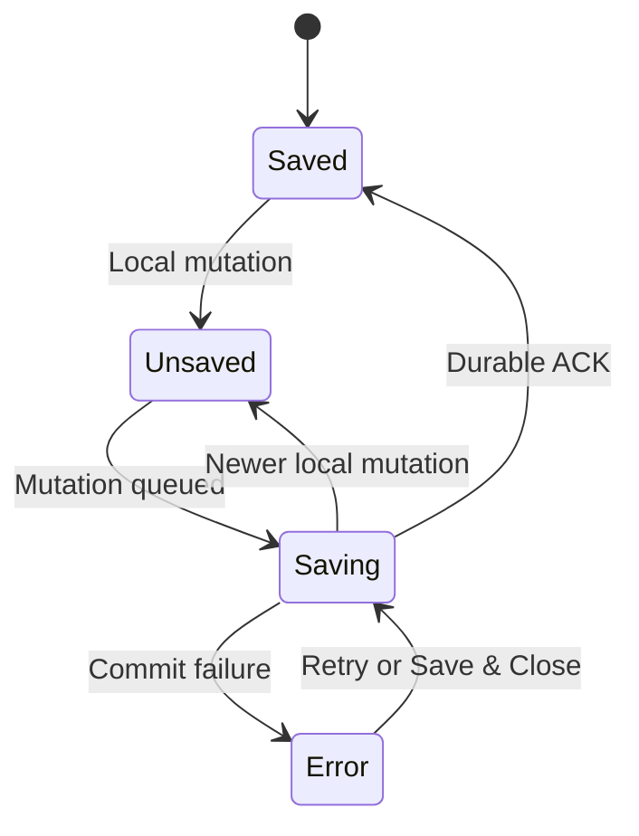
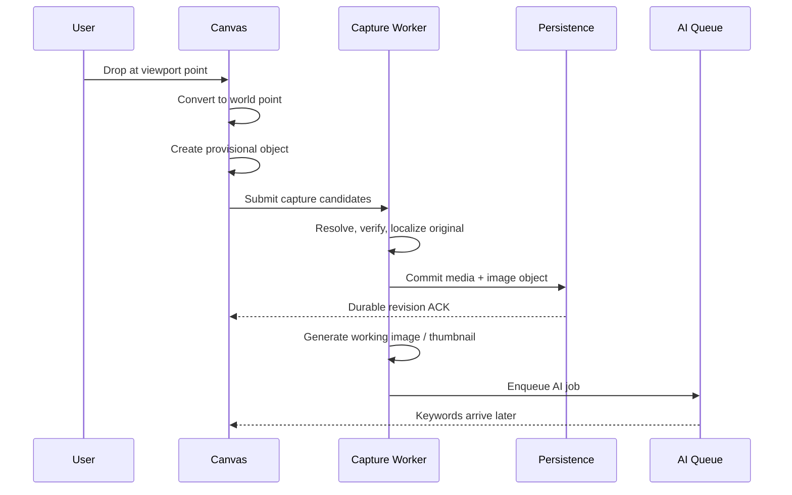
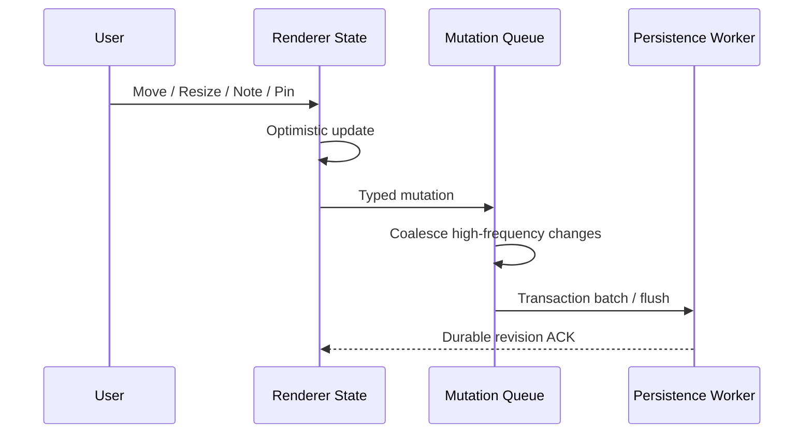

# InteractionFlow.md v2.1 — Capture-first Temporal Spatial Inspiration Board

> **Document Status**：Interaction & State Flow Baseline v2.1  
> **Product Source of Truth**：`PRD.md v2.1 — Capture-first Temporal Spatial Inspiration Board.md`  
> **Technical Source of Truth**：`Architecture.md v2.1 — Capture-first Temporal Spatial Inspiration Board`  
> **Interface Structure Inputs**：`InformationArchitecture.md v0.4` + `ReferenceMapping.md v0.2`  
> **P0 Environment**：Windows 11 + Chrome / Edge + Electron Desktop App  
> **Primary Purpose**：把产品需求转换为可实现、可测试、不会破坏用户空间思考痕迹的用户交互流与系统状态流。

---

# 0. Document Governance

## 0.1 文档职责

本文件负责定义：

- 用户在每个场景中做什么；
- 产品立即提供什么反馈；
- 前端交互状态如何转换；
- 何时创建、修改或结束一个用户意图；
- 何时只更新内存，何时请求持久化；
- Capture、Media、AI 与 Save 如何并行而不互相阻塞；
- 不同输入发生冲突时谁获得优先权；
- 错误、关闭、重启与历史 Day 中的恢复路径；
- P0 / P1 / Pro 交互边界；
- 端到端验收 Journey 如何映射到具体状态。

本文件不负责：

- 改写 PRD Requirement ID 或优先级；
- 重新选择 Electron、SQLite、媒体格式或 AI Gateway；
- 决定颜色、字体、阴影、动画曲线和具体像素；
- 编写 AI Prompt；
- 提前实现 Week / Month / Trash / Journal；
- 将用户操作转换为自动分类或自动排版。

## 0.2 Reading Rule

每条正式流程统一使用以下层级：

| 层级 | 定义 |
| --- | --- |
| **Trigger** | 用户或系统从什么事件开始 |
| **Immediate Feedback** | 用户当下必须感知到什么 |
| **Interaction State** | Renderer 中哪个状态发生变化 |
| **Background Work** | Architecture 定义的异步任务 |
| **Durable Condition** | 什么时候可以认为状态已可靠保存 |
| **Exit / Branch** | 成功、取消、失败和切换后的去向 |

InteractionFlow 中的“Saved”必须满足 Architecture 的 Durable Revision ACK。UI 已变化但未 ACK，只能称为 Optimistic / Saving / Unsaved。

## 0.3 Requirement Traceability

| InteractionFlow Section | Primary PRD Requirements | Architecture Decisions |
| --- | --- | --- |
| App Launch & Restore | `PD-001`、`WIN-001`、`WIN-004 ~ WIN-009`、`EMPTY-*` | `ADR-001`、`ADR-003` |
| Browser Drag / Paste | `CAP-001 ~ CAP-007`、`IMG-001 ~ IMG-007` | `ADR-004`、`ADR-005`、`ADR-006` |
| Canvas Navigation | `CAN-001 ~ CAN-004` | `ADR-007`、`ADR-011` |
| Select / Move / Resize | `OBJ-001 ~ OBJ-008` | `ADR-007`、`ADR-008` |
| Layer / Lock / Context Menu | `LAY-*`、`CTX-*`、`LCK-*` | `ADR-007`、`ADR-008` |
| AI & Keyword | `AI-*`、`TAG-*` | `ADR-009`、`ADR-010` |
| Quick Note | `NOTE-*`、`PC-003` | `ADR-005`、`ADR-008` |
| Time Navigation | `DAY-001 ~ DAY-011`、`TIME-*` | `ADR-007`、`ADR-012` |
| Auto-save / Close | `SAVE-001 ~ SAVE-006`、`FDBK-*` | `ADR-005`、`ADR-008` |
| Week / Month | `WEEK-*`、`MONTH-*` | `ADR-012` |
| Journal | `PC-005`、`JRN-*` | Architecture §13.2 |

---

# 1. Legacy InteractionFlow Reconciliation

旧版文件标题为：

> `VibeBoard - 交互数据流与用户流规范`

其中包含 Browser Side Panel、WeeklyBoard、IndexedDB、强制 WebP 1080px、BYOK 直连、瀑布流与拍立得装饰等旧上下文。本次不做局部修补，重新建立 InteractionFlow。

## 1.1 Retained

| 旧原则 | 新版处理 |
| --- | --- |
| 单向数据流 | 保留；改为 User Intent → Renderer State → Typed Mutation → Durable ACK → Reconcile |
| 乐观更新 | 保留；补充 Provisional、Dirty、Saving、Saved 与 Error 状态 |
| 渲染与落盘解耦 | 保留；对 Move、Resize、Pan、Zoom、Note 分别定义 Checkpoint 与 End Flush |
| Drag 中不逐事件写数据库 | 保留；改由 Mutation Coalescing + Pointer Up Flush 实现 |

## 1.2 Modified

| 旧流程 | 新流程 |
| --- | --- |
| 粘贴后生成 `ImageCard` | Drag / Paste 统一生成 `Image Object` |
| 图片绑定 `weekId` | 图片绑定当前 `dayCanvasId`，同时保留真实 `capturedAtUtc` |
| 屏幕位置直接保存 `x/y` | Drop / Paste 先转换为 World Coordinate，再保存 Geometry |
| 图片出现后立即直连 AI | Original Durable + Working Ready 后进入持久化 AI Queue |
| AI Skeleton 占据卡片底部 | AI 状态属于 Keyword Overlay，不改变 Image Bounding Box |
| Drag Start 直接修改 zIndex | 越过 Move Threshold 后临时抬高；Drag End 才永久写入最高 z-order |

## 1.3 Removed

以下流程被明确废止，不得以“旧版已有”为理由重新实现：

- 点击浏览器插件图标打开 Side Panel；
- 首次进入默认定位 WeeklyBoard；
- 瀑布流或单列卡片；
- `weekId` 作为 Capture 主归属；
- 强制压缩成 WebP 1080px / 500KB；
- IndexedDB / localforage 直接作为交互事实源；
- Renderer 直接持有 API Key；
- BYOK 作为 P0 默认；
- 所有图片强制拍立得、胶带、随机旋转；
- Drag 出画面即删除；
- 点击图片即 Bring to Front；
- 右键直接 Lock；
- Note 作为独立 Sticky Note Object；
- 日期结束后自动 Stack、Reflow 或整理；
- Capture 完成后强制进入 Journal。

## 1.4 Added

新版新增：

- 独立 Floating Desktop Window；
- Always-on-top 与 Workspace Restore；
- Pinterest / Browser → Desktop 的外部 Drag；
- Provisional → Durable → Deriving → Ready 的 Capture 状态；
- Original 本地化完成条件；
- Day Canvas 与真实 Capture Time 分离；
- World / Viewport / Camera 三空间转换；
- Image-bound Quick Note；
- Persistent First Keyword Bubble；
- Revision ACK、Clean Close 与 Unsaved Close Guard；
- 历史 Day 可继续 Capture；
- Week / Month 只读 Projection；
- Journal 对 Source Day 的不可变引用关系。

---

# 2. Global Interaction Principles

## IF-P001｜Capture First

普通 Capture 路径不得出现：

- Download；
- Save As；
- Naming；
- Folder / Project / Category 选择；
- Note 输入；
- Keyword 选择；
- Import Confirmation；
- Auto Layout Confirmation。

看到素材到释放鼠标之间，只存在一次 Drag；复制图片到留下素材之间，只存在一次 Paste。

## IF-P002｜Image First, AI Later

图片对象的出现、选择、移动、缩放、锁定与 Note 编辑不依赖：

- Working Derivative；
- AI 网络可用性；
- AI Provider 响应；
- Keyword 数量或质量。

AI 状态只能影响 Keyword Layer。

## IF-P003｜Spatial Relationship Is User Data

任何反馈层、Overlay、Loading、Error 或 Expanded State 不得：

- 推开其他图片；
- 重算对象坐标；
- 自动寻找空白区域；
- 自动改变 z-order；
- 修改用户形成的聚集关系。

## IF-P004｜Optimistic but Honest

用户动作立即改变 Renderer State，但界面不得把以下状态混为一谈：

```text
Optimistic ≠ Durable
Visible ≠ Saved
AI Ready ≠ Image Saved
```

需要显示保存结果时，以 `durableRevision` 为准。

## IF-P005｜Local Failure, Local Feedback

单张图片 Capture、Derivative、AI、Copy 或 Note Save 失败，只影响对应对象或操作。Canvas、其他对象、时间导航与后续 Capture 继续可用。

## IF-P006｜No Modal During Flow

以下操作不得使用阻断式 Modal：

- Drag / Paste Capture；
- Move / Resize；
- Pan / Zoom；
- AI Parsing；
- Keyword Expand / Copy / Pin；
- Quick Note；
- P1 普通 Delete。

唯一 P0 Modal 例外：关闭窗口时存在无法确认已保存的变化。

## IF-P007｜One Intent, One Owner

同一 Pointer / Keyboard Event 只能由一个交互意图拥有。事件一旦被高优先级意图认领，不得同时触发底层 Canvas 或 Image 行为。

---

# 3. Global State Model

## 3.1 Workspace State

```ts
type WorkspaceMode = 'inspiration-board' | 'week' | 'month' | 'journal'

interface WorkspaceInteractionState {
  mode: WorkspaceMode
  activeDayId: string
  alwaysOnTop: boolean
  windowState: 'normal' | 'maximized' | 'minimized'
  restoreState: 'idle' | 'restoring' | 'ready' | 'fallback'
}
```

P0 合法的默认模式只有 `inspiration-board`。Week / Month 为 P1，Journal 为 Pro。

## 3.2 Canvas Session State

```ts
interface CanvasSessionState {
  camera: { x: number; y: number; zoom: number }
  selectedImageId: string | null
  hoveredImageId: string | null
  movingImageId: string | null
  resizingImageId: string | null
  activeKeywordGroupId: string | null
  expandedNoteImageId: string | null
  contextMenuImageId: string | null
  pasteSequence: number
}
```

其中：

- Camera 为需要恢复的 Session Data；
- Selection、Hover、Context Menu 与 Overlay 打开状态默认是临时 UI State；
- Pinned Keyword、Quick Note 与 Geometry 是 Durable Document Data；
- Keyword Expanded State 不因普通 mouseleave 清除，但不要求跨 App Restart 恢复。

## 3.3 Image Object Interaction State

```ts
type ImageLifecycle =
  | 'received'
  | 'resolving'
  | 'localizing'
  | 'durable'
  | 'deriving'
  | 'ready'
  | 'capture-failed'

type AiLifecycle =
  | 'not-queued'
  | 'queued'
  | 'running'
  | 'succeeded'
  | 'retry-wait'
  | 'failed'
```

Image Lifecycle 与 AI Lifecycle 是两条独立状态轴：

| Image | AI | 用户可做什么 |
| --- | --- | --- |
| Resolving / Localizing | Not queued | 可继续操作 Canvas；对象保持原 Drop 意图位置 |
| Durable / Deriving | Queued / Running | Select、Move、Resize、Lock、Note 全部可用 |
| Ready | Succeeded | 完整 Image + Keyword Interaction |
| Durable / Ready | Failed | Image 与个人数据保持可用；Keyword 进入失败态 |
| Capture Failed | Not queued | 仅该 Capture 失败；后续 Canvas 操作正常 |

## 3.4 Save State

```ts
type SaveState = 'saved' | 'saving' | 'unsaved' | 'error'
```

转换：



---

# 4. Input Priority & Conflict Resolution

## 4.1 Pointer Priority

从高到低：

1. Close Guard / 系统级安全对话框；
2. Expanded Note 编辑控件；
3. Context Menu；
4. Resize Handle；
5. Keyword Bubble / Keyword Item；
6. Quick Note Compact Entry；
7. Middle Mouse Pan；
8. Image Select / Move；
9. Canvas Empty Click；
10. Wheel Zoom。

高优先级元素处理事件后必须停止向下解释。

## 4.2 Explicit Conflict Rules

| 输入场景 | 唯一解释 |
| --- | --- |
| 图片上按住中键并移动 | Pan Canvas；不移动图片 |
| 点击底层图片但未越过 Move Threshold | Select；不改变 z-order |
| 左键移动超过 Move Threshold | Move Image；进入临时交互最高层 |
| Resize Handle Drag | Resize；不得同时 Move / Pan |
| Keyword 点击 | Copy Keyword；不开始 Image Drag |
| Keyword Hover | 只显示可交互提示；不展开 Group，不强制 Select Image |
| First Keyword Click | Expand 当前 Group；Collapse 上一个 Active Group |
| Note 点击 / 输入 | Note Interaction；不移动 Image |
| 图片 Right Click | 打开 Object Context Menu；不直接 Lock |
| Canvas Empty Click | Deselect + Collapse Active Keyword Group |
| Ctrl+V | Paste Capture；不把文本写入 Canvas |
| Wheel over Canvas / Image | Zoom about pointer；不滚动页面 |

Move Threshold 的具体像素值进入 `DevelopmentSpecs.md`。只有越过阈值才算“真正拿起”，才触发临时抬高和 Drag End 永久 z-order。

---

# 5. App Launch & Workspace Restore Flow

## 5.1 First Launch

### Trigger

用户首次启动 Desktop App。

### Immediate Feedback

- 打开独立 Inspiration Board Window；
- 显示当天 Day Canvas；
- 日期持续可见；
- 空 Canvas 就是正常 Canvas；
- 不出现大型 Onboarding、创建项目或“今天还没有灵感”CTA。

### Interaction State

```text
mode = inspiration-board
activeDayId = today
restoreState = ready
selectedImageId = null
```

### Exit

用户可以立即 Drag、Paste、Pan 或 Zoom，无需完成设置向导。

## 5.2 Returning Launch

### Trigger

用户重新打开应用。

### Background Work

并行恢复：

- Window Position / Size；
- Always-on-top；
- 上次 Active Day；
- 该 Day Camera / Zoom；
- Durable Image Objects、Geometry、z-order、Lock、Note、Keywords、Pinned Keyword。

### Immediate Feedback

优先恢复一个稳定工作现场，不播放会改变对象位置的入场动画。

### Durable Condition

所有显示对象来自 Durable State；未完成 Capture Job 按 Architecture 的 Recovery 规则恢复。

### Fallback

若上次显示器不存在：

- Window 被夹入当前可见工作区；
- Day、Camera 与 World Geometry 不改变；
- 不把 Window 修正误写成 Canvas 坐标修正。

## 5.3 Always-on-top Toggle

### Trigger

用户切换 Always-on-top 控件。

### Immediate Feedback

窗口层级发生变化；Canvas State 不重载、不重排。

### State Flow

```text
User Intent
→ Main Process setAlwaysOnTop
→ Main confirms actual state
→ UI reconciles toggle
→ Workspace State autosaves
```

若系统拒绝或调用失败，Toggle 回到真实状态并提供轻量错误；不得假装开启成功。

---

# 6. Pinterest / Browser Drag Capture Flow

## 6.1 Happy Path

### Trigger

用户从 Chrome / Edge 的 Pinterest 可拖取图片拖到当前 Day Canvas，并在某个位置松手。

### Immediate Feedback

1. Canvas 接受 Drop；
2. Drop Point 转换成 World Point；
3. 在该位置建立 Provisional Image Object；
4. 若已有可显示 Blob / Preview，立即显示图片；
5. 若需要解析远程候选，仅在对象局部显示轻量 Loading；
6. Canvas 其他区域继续可交互；
7. 不弹 Import Modal。

### Interaction State

```text
activeDayId is captured at Drop time
sourceType = browser-drag
spawnWorldPoint = dropWorldPoint
imageLifecycle = received → resolving → localizing
saveState = unsaved → saving
```

### Background Work



### Durable Condition

以下同时成立：

- Original 已进入本地 Profile；
- Image Object 已绑定当前 `dayCanvasId`；
- `capturedAtUtc` 已保存；
- 初始 World Geometry 与 z-order 已提交；
- Renderer 收到 Durable Revision ACK。

### Post-Durable Flow

1. Provisional Preview 原位替换为 Durable Media；
2. 不改变 x、y、width、height 与 z-order；
3. 生成 Working / Thumbnail；
4. AI Job 异步开始；
5. AI 成功后首词 Bubble 出现；
6. 用户全程可以继续浏览 Pinterest 并拖下一张。

## 6.2 Drop Position Rule

Image 初始视觉中心对应 Drop Point。系统只允许：

- 根据图片宽高比计算舒适初始尺寸；
- 在多次 Capture 极度重合时施加极轻 Micro Offset。

系统不得：

- 搜索“最佳空白区”；
- 自动排到现有图片旁边；
- 整齐级联；
- 自动分组；
- 移动其他对象。

## 6.3 Historical Day Drag

### Trigger

用户正在查看历史 Day，并从 Pinterest Drop 新图。

### Binding Rule

```text
targetDayCanvasId = Drop 当下正在查看的 Day
capturedAtUtc = 当前真实时间
```

系统不得：

- 切回 Today；
- 把图片偷偷保存到 Today；
- 用历史 Day 日期覆盖真实 Capture Time。

## 6.4 Drag Failure Branches

| 失败点 | Immediate Feedback | 后续状态 |
| --- | --- | --- |
| 无有效图片候选 | 对该 Drop 给出轻量失败反馈 | 不创建 Durable Image；Canvas 继续 |
| URL 超时 / 失效 | Provisional Object 标记 Capture Failed | 可关闭该局部反馈；其他操作继续 |
| 响应不是图片 | 该 Capture 失败 | 不执行 HTML、不进入 AI |
| 图片过大 / 解码失败 | 该 Capture 失败 | 不锁 Canvas；保留安全诊断 |
| Persistence 失败 | 对象保持 Unsaved / Error | Close 时进入 Guard；不得显示 Saved |

失败不得触发：

- 全局 Loading；
- Canvas 禁用；
- 自动切换输入方式；
- 强迫用户打开 Import 页面；
- 删除此前已 Durable 的对象。

---

# 7. Clipboard Paste Capture Flow

## 7.1 Happy Path

### Trigger

用户在 Chrome / Edge 复制图片，回到 Canvas 后按 `Ctrl+V`。

### Immediate Feedback

- 在当前 Viewport 中心附近生成 Image Object；
- 连续 Paste 根据 `pasteSequence` 产生轻微 Micro Offset；
- 不打开 Paste / Import Dialog；
- 不要求先选中 Canvas 空白。

### State Flow

```text
Clipboard Event
→ Read Image Blob / HTML / URL Candidates
→ Create CaptureIntent(sourceType = clipboard-paste)
→ Spawn at viewport center + micro offset
→ Enter same Provisional / Durable / AI flow as Browser Drag
```

### Durable Condition

与 Drag 完全一致。Drag 与 Paste 不能形成两套 Image、Note、Keyword、Lock、Save 数据结构。

## 7.2 Paste Edge Cases

| Clipboard 内容 | 处理 |
| --- | --- |
| 有效 Image Blob | 直接进入本地化 |
| HTML 含有效 Image URL | 只提取候选，不执行 HTML |
| 纯 HTTPS Image URL | 进入安全远程解析 |
| 只有普通文本 | 不创建 Sticky Note，不污染 Canvas |
| 多个可用候选 | 按 Architecture Candidate Priority 选择 |

---

# 8. Image Initialization Flow

## 8.1 Comfortable Initial Size

图片尺寸信息可用后：

1. 保持原始宽高比；
2. 根据当前 Viewport 计算舒适初始尺寸；
3. 防止超大原图按原始像素铺满窗口；
4. 不强制统一宽高；
5. 不改变 Drop / Paste 的位置语义；
6. 用户随后可以自由 Resize。

初始尺寸算法和阈值进入 `DevelopmentSpecs.md`。

## 8.2 Provisional Geometry Reconciliation

若 Drop 时尚未获得真实宽高：

- 先保留 Drop Anchor；
- 宽高确认后围绕同一 Anchor 展开；
- 不把对象跳到其他空白位置；
- 不移动周围对象；
- 最终 Geometry 进入同一次 Durable Capture Commit 或后续幂等修正。

## 8.3 Overlap

自由重叠是正常状态。Micro Offset 只在新对象与近期 Capture 几乎完全重合时发生，目的仅是暴露下方仍有对象，不形成自动布局。

---

# 9. Canvas Navigation Flow

## 9.1 Wheel Zoom

### Trigger

鼠标位于 Canvas 或 Image 上方，滚动滚轮。

### Immediate Feedback

- 前滚 Zoom In；
- 后滚 Zoom Out；
- 指针下的 World Point 保持在视觉上同一位置；
- 浏览器页面不发生纵向滚动。

### State Flow

```text
wheel
→ calculate world point under pointer
→ update camera in memory every frame
→ coalesce camera mutation
→ checkpoint during continuous input
→ flush after interaction settles
```

### Invariant

Zoom 只改变 Camera，不修改任何 Image World Geometry。

## 9.2 Middle Mouse Pan

### Trigger

用户按住中键并拖动。

### Immediate Feedback

Canvas 随 Pointer 平移；对象之间的相对空间关系不变。

### Conflict Rule

即使起点位于 Image 上，中键仍由 Pan 拥有，不进入 Image Move。

### Durable Condition

Pan 结束后的 Camera Offset 获得 Durable ACK。

## 9.3 Space + Drag

Space + Drag 可以未来作为辅助能力，但 P0 不能依赖它完成主要 Pan。中键 Pan 必须独立可用。

---

# 10. Selection, Move & Resize Flow

## 10.1 Selection

### Select

```text
Left Click Image
→ selectedImageId = image.id
→ show clear selection state
→ do not change z-order
```

### Deselect

```text
Click Canvas Empty
→ selectedImageId = null
→ activeKeywordGroupId = null
→ keep all Geometry unchanged
```

点击 Keyword、Note 或 Context Menu 项不应被 Canvas Empty Click 捕获。

## 10.2 Move

### Trigger

用户在未 Lock Image 上按下左键并移动超过 Move Threshold。

### Immediate Feedback

- Image 跟随 Pointer；
- 绑定 Quick Note 跟随 Image；
- Keyword Overlay 保持绑定；
- 对象临时显示在交互最高层；
- 其他对象不避让。

### Interaction State

```text
pointerDown → move-pending
threshold crossed → moving
pointerMove → optimistic world geometry
pointerUp → move-committing
durable ACK → idle/saved
```

### Durable Mutation

Drag End 在同一 Mutation 中提交：

- 最终 World x / y；
- 新的最高 z-order；
- Entity Revision。

### Cancel / Loss of Pointer

若系统取消 Pointer：

- 使用最后一个合法 Interaction State；
- 不生成重复 Mutation；
- 不允许临时交互 z-order 留在永久数据中，除非 Move 已正式 Commit。

## 10.3 Resize

### Trigger

用户拖动 Selected Image 的任一角 Handle。

### Immediate Feedback

- 默认等比 Resize；
- 图片原始宽高比保持；
- Note 与 Keyword 的绑定锚点随新 Bounding Box 投影；
- Expanded Overlay 不参与布局计算；
- 其他图片不移动。

### Durable Flow

Resize 中只做内存更新与合并 Checkpoint；Pointer Up 立即 Flush 最终 width / height。

## 10.4 Locked Image

锁定对象：

- 可以 Select；
- 不显示可执行 Resize Handle；
- 左键移动不改变 Geometry；
- Hover / Expand / Copy Keyword 正常；
- Add / Edit / Expand Note 正常；
- Right Click 正常；
- Context Menu 第一项显示 Unlock。

核心路由：

```text
locked + geometry intent → reject without mutation
locked + semantic/note intent → allow
```

---

# 11. Context Menu & Layer Flow

## 11.1 Open Context Menu

```text
Right Click Image
→ prevent native canvas interpretation
→ select context target for menu only
→ open Object Context Menu near pointer
→ first item = Lock or Unlock
```

Right Click 本身不执行 Lock，也不改变 z-order。

## 11.2 Lock / Unlock

```text
Choose Lock
→ optimistic isLocked = true
→ hide executable handles
→ immediate durable flush
→ ACK = saved
```

Unlock 反向执行，不自动开始 Move。

## 11.3 Layering

| 行为 | z-order 结果 |
| --- | --- |
| Click Image | 不变 |
| Hover Image | 不变 |
| Open Keyword / Note | 不变 |
| Right Click | 不变 |
| Move Threshold Crossed | 仅临时交互抬高 |
| Drag End | 永久成为最高层 |
| New Capture Durable | 成为最高层 |
| P1 Bring to Front / Send to Back | 显式修改 |

---

# 12. AI Visual Parsing Flow

## 12.1 Start Condition

AI Job 只在以下条件成立后开始：

- Image Original 已 Durable；
- Working Image 可用；
- Job 尚未成功完成；
- AI Queue 可以接受任务。

用户无需点击 Analyze。

## 12.2 Running State

### Immediate Feedback

Keyword 区域可显示轻量 Working State，但不得：

- 遮住或锁定 Image；
- 改变 Image Bounding Box；
- 阻止 Move / Resize / Lock / Note；
- 打开全局 Loading；
- 自动聚焦 Keyword 区域。

## 12.3 Success

```text
AI response
→ schema validation
→ normalize 5–10 keywords
→ persist result + job completion transaction
→ durable ACK
→ show folded first keyword bubble
```

默认首词是 AI 返回第一词；已有用户 Pin 时，AI 结果刷新不得覆盖 Pin。

## 12.4 Failure

AI 失败后：

- Image 保留；
- Geometry / Note / Lock 保留；
- Canvas 继续；
- 失败只显示在 Keyword Layer；
- P1 提供 Retry；
- App 重启后 Queue 可恢复；
- 不重复上传 Quick Note、Day Title、Canvas Geometry 或浏览历史。

---

# 13. Keyword Interaction Flow

## 13.1 Default Folded State

AI 成功后，每张 Image 默认显示一个 `First Keyword +N` Bubble：

- 无需 Hover Image 即可看到；
- 位于 Image 上方 / 上方靠右的信息区域；
- 不进入 Image Bounding Box；
- 不改变 z-order。

其中 `N = 当前 Keyword 总数 - 1`。

## 13.2 Expand

```text
Click First Keyword Bubble
→ activeKeywordGroupId = image.id
→ previous active group collapses
→ current full keyword group expands downward
```

Hover 只提供可交互提示。普通 mouseleave 不改变 `activeKeywordGroupId`。

## 13.3 Collapse

只有以下事件自动 Collapse：

1. Canvas Empty Click；
2. 激活另一张 Image 的 Keyword Group。

同一时间最多一个完整 Expanded Keyword Group。

不提供独立 Close Button。

## 13.4 Copy

```text
Click Keyword
→ request system clipboard write
→ success: lightweight copied feedback
→ keep current group expanded
```

Copy 失败：

- Group 保持 Expanded；
- Keyword 不删除；
- 使用局部或轻量错误；
- 不打开 Modal。

## 13.5 Pin First Keyword

```text
Choose Pin on a keyword
→ optimistic pinnedKeywordId update
→ folded bubble immediately shows chosen word
→ immediate durable flush
→ ACK preserves choice across Day revisit/restart
```

Pin 不删除或重排其他关键词。

## 13.6 P1 Visibility Toggle

| Toggle | 行为 |
| --- | --- |
| ON（默认） | 所有成功解析 Image 显示 First Keyword Bubble |
| OFF | 仅 Hover / Select Image 时显示 Keyword Entry |

Toggle 只改变 Keyword Visibility，不删除 Keyword Data，不改变 Geometry。

---

# 14. Image-bound Quick Note Flow

## 14.1 Create Note

### Trigger

用户通过 Image 的 Note Entry 创建 Quick Note。

### Immediate Feedback

- Note 编辑入口锚定在 Image 下方；
- Note Surface 使用横线纸 PNG；
- Note Width 始终等于 Image 当前显示宽度；
- 不创建独立 Canvas Object；
- 不要求填写；
- 空 Note 不产生未完成提醒或待办角标。

## 14.2 Edit & Autosave

```text
Input
→ update note draft in memory
→ saveState = unsaved/saving
→ debounce durable mutation
→ blur or explicit end = immediate flush
→ ACK = saved
```

Note 输入期间不得触发 Image Move。Image Lock 不影响 Note 编辑。

## 14.3 Compact State

非编辑状态默认显示有限内容：

- 中文与英文均最多三行；
- 长内容省略；
- 具体字符与行数进入 `DevelopmentSpecs.md`。

## 14.4 Expand Overlay

```text
Click Compact Note
→ expandedNoteImageId = image.id
→ render full note as overlay
→ keep image geometry unchanged
```

Expanded Overlay：

- Width 继续与 Image 一致；
- Height 按完整段落自然增长；
- 不增加 Image Height；
- 不推动其他 Image；
- 不触发 Reflow；
- 不改变 z-order 数据；
- 收起后恢复同一空间现场；
- Lock Image 时仍可编辑。

Overlay 的关闭手势与焦点细节进入 `DevelopmentSpecs.md`，但任何关闭方式都不得提交 Geometry Mutation。

## 14.5 Move with Note

Image Move 时，Note 的显示锚点随 Image Bounding Box 重新投影。数据库只保存 Note 与 Image 的绑定，不保存一套独立可漂移的 Note x/y。

---

# 15. Time Identity & Day Navigation Flow

## 15.1 Persistent Title & Date

当前 Day 日期始终可见。P0 的自定义 Day Title 出现后：

```text
Day Title
Date · Weekday
```

无 Title 时只显示日期，不出现强提醒式 `Untitled`。

无自定义标题时，Date / Date Range 作为主标题；有标题时，Title 成为主信息，Date / Date Range 缩小并降低视觉权重。System Voice 使用 Segoe UI（英文）/ PingFang SC（简体中文）；Personal Voice 使用 Chenyuluoyan（英文）/ momozhuanji（中文），覆盖相应语言的 Title、Quick Note 与其他非系统文字。字体由字符脚本自动映射，不提供语言切换控件。

## 15.2 Previous / Next Day

### Trigger

用户点击 Previous Day 或 Next Day。

### Flow

1. 捕获目标日期；
2. 当前 Day 的未完成 Mutation 继续由 Queue Flush，不用 Modal 阻塞导航；
3. 加载目标 Day Durable Scene 与 Camera；
4. `activeDayId` 切换到目标 Day；
5. 新 Capture 绑定新 Active Day；
6. 不修改离开 Day 的 Geometry。

若目标 Day 加载失败，保留当前工作现场并给出轻量错误，不显示空白假数据覆盖目标 Day。

## 15.3 Today

点击 Today：

- 进入今天的 Day Canvas；
- 恢复今天自己的 Camera；
- 不把其他 Day 的 Viewport 复制到 Today；
- 不自动移动历史 Day 新 Capture。

## 15.4 Date Boundary While App Is Open

午夜经过时：

- 当前正在查看的 Day 不自动切换；
- 当前 Day 的日期标签不改变；
- 用户主动进入 Today 后才打开新日期；
- 新 Capture 始终绑定当下 Active Day；
- `capturedAtUtc` 使用真实时间。

---

# 16. Empty Canvas Flow

空 Day Canvas 的状态：

```text
normal canvas
active date visible
pan / zoom / paste / drop available
no task completion framing
```

禁止：

- 大型 CTA；
- “今天还没有灵感”；
- 强制 Onboarding 卡；
- 创建项目按钮占据主区域；
- 因为空而自动跳转 Today 或 Week。

P1 如增加提示，只能是可忽略、低干扰的操作暗示。

---

# 17. Auto-save & Close Flow

## 17.1 General Autosave



## 17.2 Interaction-specific Save Boundaries

| Interaction | 内存更新 | Checkpoint | End Flush |
| --- | ---: | ---: | ---: |
| Move | 每 Pointer Frame | 长 Drag 期间 | Pointer Up |
| Resize | 每 Pointer Frame | 长 Resize 期间 | Pointer Up |
| Pan / Zoom | 每 Frame | 连续输入期间 | Interaction Settle |
| Note | 每次输入 | Debounce | Blur / Close Editor |
| Lock / Unlock | 立即 | 不需要 | 立即 |
| Keyword Pin | 立即 | 不需要 | 立即 |
| Drop / Paste Intent | 立即 | 不需要 | 立即写 Intent |
| Media Durable | 状态替换 | 不需要 | 立即 Transaction |
| Window Bounds | Main 内存 | Debounce | Close |

## 17.3 Clean Close

### Trigger

用户关闭窗口。

### Condition

```text
durableRevision >= localRevision
and no required flush failure
```

### Result

直接关闭，不显示无意义警告。

## 17.4 Pending Close

若有排队中的正常 Mutation：

1. Main 暂停真正关闭；
2. 请求最后 Flush；
3. Flush 成功 → 关闭；
4. 用户不应看到 Modal 闪烁；
5. 只有 Flush 失败、超时或状态无法确认时才进入 Guard。

## 17.5 Unsaved Close Guard

Guard 固定提供：

- **Save & Close**
- **Close Without Saving**
- **Cancel**

### Save & Close

```text
retry/flush
→ success: close
→ failure: keep guard open and show specific error
```

### Close Without Saving

- 必须由用户主动选择；
- 丢弃未 Durable 的内存变化；
- 不回滚此前 Durable Data；
- 不把失败中的 AI Job 当作未保存用户数据；
- 不因 AI 仍运行而阻止关闭。

### Cancel

- 关闭 Guard；
- 返回同一 Day、Camera、Selection 与编辑现场；
- 不重载 Canvas；
- 不清空 Mutation Queue。

---

# 18. Non-blocking Error Feedback

## 18.1 Feedback Scope

| 错误 | Scope | 是否阻断 Canvas |
| --- | --- | ---: |
| 单图 Capture | Image-local / lightweight | 否 |
| Derivative | Image-local / background | 否 |
| AI | Keyword-local | 否 |
| Clipboard Copy | Keyword-local / lightweight | 否 |
| Day Load | Time navigation feedback | 否；保留当前 Day |
| Autosave | Global save safety state | 不立即阻断；Close 时 Guard |
| Fatal Profile / Migration | App-level recovery screen | 是；防止覆盖数据 |

## 18.2 Feedback Rules

- 错误信息不遮挡用户正在移动的对象；
- 同类后台错误需要聚合，避免 Toast 风暴；
- Error 消失不等于问题已修复；
- Retry 成功后才清除对应 Error State；
- 无错误不得长期展示警告；
- 具体位置、图标和动画进入 `DevelopmentSpecs.md`。

---

# 19. P1 Interaction Flows

本节定义 P1 关系，但不得挤占 P0 开发顺序。Day Title 已移入 P0，不再属于本节。

## 19.1 Optional Day Title — MOVED TO P0

```text
Edit single Day Title
→ optimistic text update
→ debounce/blur flush
→ date remains visible
```

- 一张 Day 只有一个可选总标题；
- 空标题不显示 `Untitled`；
- 不提供区域标题；
- Title 不改变 Image Geometry。

本节保留时序说明，但优先级以 PRD v2.1 的 P0 为准。

## 19.2 Week View

```text
Open Week
→ query Day projections
→ render one Day Stack per Day
→ click Day Stack
→ restore original Day Scene + Camera
```

Week Stack 不允许直接修改 Day 的 x/y、size、z-order、Note 或 Keyword State。

## 19.3 Month View

Month 以 Day 为主要单位进行更高时间压缩。进入 Day / Week 时加载原始数据，Month 自身不拥有可回写 Geometry。

## 19.4 Manual Save

`Ctrl+S`：

- 请求立即 Flush 当前 Mutation Queue；
- 成功后给出轻量 Saved Feedback；
- 失败进入 Save Error；
- 不替代 Autosave。

## 19.5 Trash

### Normal Delete

```text
Delete Image
→ remove from active scene optimistically
→ create soft-delete mutation
→ no confirmation modal
→ enter Trash
```

### Restore

恢复时回到原 Day 与原 Durable Geometry / z-order / Note / Keyword State。不得将 Restore Image 自动放到“当前最佳空白位置”。

### Permanent Delete

只能从 Trash 中由用户明确执行。具体 Confirmation 进入 P1 UI 规范。

### Keyword Delete

使用非阻断 Undo；Undo 时长由 `DevelopmentSpecs.md` 决定。不得沿用旧版固定 5 秒作为产品事实。

---

# 20. Pro Journal Flow Boundary

## 20.1 Enter Journal Cabinet

Journal Cabinet 是独立 Workspace Mode，不是 Capture 后自动下一步。

```text
User explicitly opens Journal Cabinet
→ select/create Journal Book
→ choose one or more Day sources
→ create source references in Material Inbox
```

## 20.2 Use Source Material

同一 Source Image 可以：

- 被多个 Journal 引用；
- 在 Journal 内拥有不同位置、尺寸和 Cutout；
- 在 Source Day 中保持完全不变。

## 20.3 Source Immutability

```text
Journal Move / Resize / Delete / Cutout / Recompose
→ mutate Journal Instance only
→ never mutate Day Image Object or Original Media
```

Journal 中删除实例不等于删除 Capture；Journal 完成不改变 Source Day 的时间与空间现场。

---

# 21. End-to-End Acceptance Journeys

## Journey A｜Pinterest Fast Capture

| Step | User Action | Required Feedback / State |
| ---: | --- | --- |
| 1 | 浏览 Pinterest | Desktop Board 可悬浮在旁 |
| 2 | Drag 图片到某点 | 原 Drop 点建立 Provisional Object |
| 3 | 继续浏览 | 无 Modal；Canvas 不锁定 |
| 4 | Media Durable | 图片原位转为 Durable；空间不跳动 |
| 5 | AI 后台运行 | Image Move / Resize / Note 可用 |
| 6 | 首词出现 | 默认可见，不要求 Hover Image |
| 7 | Click 首词 | 展开 5–10 Keywords |
| 8 | Click Keyword | Copy；Group 保持 Expanded |

失败条件：出现 Download、Naming、Category、Project、Note、Confirm 或 Auto Arrange 前置步骤。

## Journey B｜Clipboard Capture

| Step | User Action | Required Feedback / State |
| ---: | --- | --- |
| 1 | Copy Image | Clipboard 持有候选 |
| 2 | `Ctrl+V` | Viewport 中心附近出现 Image |
| 3 | 连续 Paste | 轻微 Micro Offset，不完全重合 |
| 4 | 后续操作 | 与 Drag Image 完全一致 |

## Journey C｜Spatial Thinking

| Step | User Action | Required Feedback / State |
| ---: | --- | --- |
| 1 | Capture 多张图片 | 允许自然重叠 |
| 2 | Click 底层图 | 只 Select，不置顶 |
| 3 | Move 底层图 | 临时抬高；Drop 后永久最高层 |
| 4 | Resize | 等比；其他对象不移动 |
| 5 | Add Note | Note 绑定 Image |
| 6 | Lock | Geometry 冻结；Note/Keyword 可用 |
| 7 | Restart | Geometry、z-order、Note、Lock、Keyword、Camera 全恢复 |

## Journey D｜Historical Continuation

| Step | User Action | Required Feedback / State |
| ---: | --- | --- |
| 1 | 进入三天前 Day | 恢复该 Day Scene + Camera |
| 2 | Drag 新图 | 进入历史 Day，不切 Today |
| 3 | Save | 同时保留历史 `dayCanvasId` 与真实 `capturedAtUtc` |

## Journey E｜Keyword Work

```text
First Bubble +N visible
→ Click A: expand A
→ Mouseleave A: keep A expanded
→ Click keyword in A: copy, keep A expanded
→ Click B: collapse A, expand B
→ Click Canvas Empty: collapse B
→ Pin keyword: folded bubble changes and persists
```

## Journey F｜Quick Note

```text
Select Image
→ Create Note below Image
→ Compact display
→ Expand as overlay
→ no object displacement
→ collapse to original scene
→ Move Image: Note follows
→ Lock Image: Note remains editable
```

## Journey G｜Safe Close

```text
All revisions durable
→ Close directly

Pending queue
→ silent final flush
→ success: close

Flush failure / unconfirmed revision
→ Save & Close | Close Without Saving | Cancel
```

---

# 22. Event-to-Mutation Matrix

| Event | Optimistic UI | Durable Document Mutation | Durable Session Mutation | AI Trigger |
| --- | ---: | ---: | ---: | ---: |
| Browser Drop | 是 | Capture Intent + Image + Media | 否 | Media Durable 后 |
| Clipboard Paste | 是 | Capture Intent + Image + Media | 否 | Media Durable 后 |
| Image Click | 是 | 否 | 否 | 否 |
| Image Move End | 是 | Geometry + z-order | 否 | 否 |
| Resize End | 是 | Geometry | 否 | 否 |
| Lock / Unlock | 是 | Lock State | 否 | 否 |
| Wheel Zoom | 是 | 否 | Camera | 否 |
| Middle Pan | 是 | 否 | Camera | 否 |
| Keyword Expand | 是 | 否 | 否 | 否 |
| Keyword Copy | Clipboard Feedback | 否 | 否 | 否 |
| Keyword Pin | 是 | Pinned Preference | 否 | 否 |
| Note Edit | 是 | Quick Note | 否 | 否 |
| Day Navigation | 是 | 否 | Active Day + Day Camera | 否 |
| Always-on-top | 是/校正 | 否 | Workspace State | 否 |
| Window Move / Resize | 是 | 否 | Workspace State | 否 |
| AI Success | 是 | Keywords + AI Job | 否 | 已完成 |

---

# 23. Interaction Acceptance Checklist

## 23.1 Capture

- [ ] Chrome 与 Edge 的 Pinterest Drag 均能在 Drop 世界位置创建对象。
- [ ] Drag / Paste 不要求 Download、Naming、Category、Project、Note 或 Confirm。
- [ ] Paste 默认在 Viewport 中心附近，连续 Paste 有轻微 Micro Offset。
- [ ] Drag / Paste 进入同一个 Image Object Flow。
- [ ] Capture 失败不影响下一次 Drag / Paste。
- [ ] Remote URL 失效后 Durable Image 仍可显示。

## 23.2 Spatial Canvas

- [ ] Wheel Zoom 保持 Pointer 下 World Point。
- [ ] Middle Mouse 在 Image 上仍执行 Pan。
- [ ] Click Image 不改变 z-order。
- [ ] 越过 Move Threshold 后才临时抬高。
- [ ] Drag End 才永久最高层。
- [ ] Resize 默认等比。
- [ ] Lock 只冻结 Position / Size。
- [ ] Note / Keyword Overlay 不触发 Reflow。

## 23.3 Semantic & Personal Layers

- [ ] AI Loading 不锁 Image。
- [ ] AI 成功后 `First Keyword +N` 默认可见，N 准确。
- [ ] Hover 不展开；Click 首词才展开。
- [ ] Mouseleave 不立即 Collapse Keyword Group。
- [ ] Copy 后 Group 保持 Expanded。
- [ ] 同时最多一个 Expanded Keyword Group。
- [ ] 激活新 Group 或点击 Canvas 空白时旧 Group 折叠。
- [ ] Expanded Group 不提供 Close Button。
- [ ] Pin 跨 Day Revisit / Restart 保留。
- [ ] Quick Note 绑定 Image，移动时跟随。
- [ ] Lock 状态仍可编辑 Note。

## 23.4 Time & Restore

- [ ] 日期持续可见。
- [ ] 历史 Day 可编辑、可继续 Capture。
- [ ] Historical Day ID 与真实 Capture Time 同时正确。
- [ ] Midnight 不自动切走当前 Day。
- [ ] Restart 恢复 Window、Always-on-top、Active Day、Camera 和 Scene。
- [ ] Window Fallback 不改变 World Geometry。

## 23.5 Save & Failure

- [ ] 未收到 Durable ACK 时不显示 Saved。
- [ ] 高频输入不逐事件写 SQLite。
- [ ] Pointer Up / Blur / Lock / Pin 正确 Flush。
- [ ] Clean Close 不弹 Guard。
- [ ] Pending Mutation 先静默 Final Flush。
- [ ] Flush 失败才显示三选项 Guard。
- [ ] AI 失败不触发 Close Guard。
- [ ] Cancel 返回原工作现场。

---

# 24. Open UI-spec Questions

以下交互关系已经确定，但视觉或精确手势留给 `DevelopmentSpecs.md`：

- Move Threshold 的像素值；
- Initial Image Size 的 Viewport 比例与上下限；
- Micro Offset 的视觉像素与序列；
- Provisional、AI Running、Capture Failed 的具体视觉；
- Selection Outline 与 Handle 尺寸；
- Context Menu 的视觉与边界吸附；
- Note 三行字符截断与 Overlay 关闭手势；
- Copy、Save、Error 的反馈位置与时长；
- Keyword Pin 的入口形式；
- Always-on-top 控件位置；
- P1 Undo 时长；
- Week / Month Projection 的视觉语言。

实现者不得用这些未定视觉细节重新解释已确定的数据、状态与空间规则。

---

# 25. Final Interaction Statement

P0 的核心交互闭环是：

> **用户在 Chrome / Edge 中看到图片，将它拖到始终存在于工作环境旁的 Desktop Day Canvas；图片在松手位置立即成为可操作对象，系统在后台把媒体可靠收归本地、持续保存用户形成的空间关系，并在不上传个人 Note 与 Canvas 关系的前提下异步补充设计关键词。用户可以继续摆放、缩放、书写和回到历史 Day，关闭后再次打开时，桌子仍保持原样。**

任何流程若要求用户在 Capture 前整理信息、让 AI 成为图片出现的前置条件、把 Loading 或 Note 展开变成空间重排、让 Click 改变层级、把历史 Capture 强制送入 Today，或在 Durable ACK 前宣称保存完成，均不符合本 InteractionFlow。

---

# 26. Board Chrome & Global Action Flow Sync

## 26.1 Global Action Bar

左侧固定顺序：More → Journal → Theme → Download / Share → Trash。Inspiration Board 是默认主体，不出现 Board / Home Icon。

- More 打开低频功能分组；
- Journal 打开 Gateway，不直接静默搬移素材；
- Theme 打开 Background Surface Picker；
- Download / Share 打开当前页面输出菜单；
- Trash 进入 P1 Trash。

任一 Popover 打开时必须保留 Canvas Scene，不触发 Geometry Mutation。

## 26.2 Temporal Controls

右上上层为 Previous / Today / Next；下层为 Day / Weekly / Monthly View Mode Selector。时间控件与左侧 Global Action Bar 独立。

## 26.3 Theme

选择底板只更新 Workspace 级 Background Surface Preference，并在重启后恢复。不得修改 Image Filter、Geometry、Keyword 或 Quick Note。每 Day 独立背景仍为 Deferred。

## 26.4 Journal Gateway

Pro Gateway 未来提供 Add Selected Images、Add Current Day、Open Journal Cabinet。当前主体开发只保留入口与接口边界，不实现 Journal 页面。

---

# End of InteractionFlow.md v2.1
